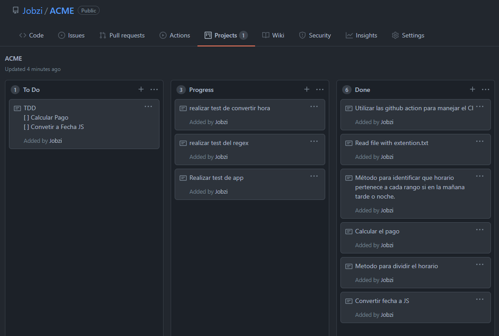

## Hi, everyone... Welcome to ACME

For ACME developer. I used Javascript with a "standard" [ESLint](https://eslint.org/) linter. Thanks to the Linter it helps a lot to maintain a readable code following rules determined by javascript stander.
 In conjunction with [nodemon](https://github.com/remy/nodemon) for a more fluid development.

## Overview of project
**Clone** — 

```terminal
git clone https://github.com/Jobzi/ACME.git
```

**Install** — For this proyect I used nodejs

```terminal
npm install
```

**Develop** — In the 'scripts' administration (it is a hash object of script commands that are executed at various times in the life cycle of your package).  To run in development mode use the following command.
```terminal
npm run dev
```

**Test** — The following command is used to run the tests. [Jest](https://jestjs.io/) is a JavaScript testing framework designed to ensure the correctness of any JavaScript code base.
```terminal
npm run test
```

**Start** — Run de proyect
```terminal
npm run start
```

<details><summary>Problem Description</summary>

The company ACME offers their employees the flexibility to work the hours they want. They will pay for the hours worked based on the day of the week and time of day, according to the following table:

| Monday - Friday|Price  |
|----------------|-------|
| 00:01 - 09:00  |25 USD |
| 09:01 - 18:00  |15 USD |
| 18:01 - 00:00  |20 USD |


| Saturday - Sunday |Price  |
|-------------------|-------|
| 00:01 - 09:00     |30 USD |
| 09:01 - 18:00     |20 USD |
| 18:01 - 00:00     |25 USD |

The goal of this exercise is to calculate the total that the company has to pay an employee, based on the hours they worked and the times during which they worked. The following abbreviations will be used for entering data:

| Monday | Tuesday | Wednesday | Thursday | Friday | Saturday | Sunday |
|--------|---------|-----------|----------|--------|----------|--------|
| MO     | TU      | WE        | TH       | FR     | SA       | SU     |

**Input:** the name of an employee and the schedule they worked, indicating the time and hours. This should be a .txt file with at least five sets of data. You can include the data from our two examples below.

**Output:** indicate how much the employee has to be paid

For example:

| Case       | Case 1                                                                     | Case 2                                           |
|------------|----------------------------------------------------------------------------|--------------------------------------------------|
| **Input**  | RENE=MO10:00-12:00,TU10:00-12:00,TH01:00-03:00,SA14:00-18:00,SU20:00-21:00 | ASTRID=MO10:00-12:00,TH12:00-14:00,SU20:00-21:00 |
| **Output** | The amount to pay RENE is: 215 USD                                         | The amount to pay ASTRID is: 85 USD              |

</details>
<details><summary>Architecture</summary>
In order to have a better architecture it was decided to separate the logic in different modules, we have the payment calculator controller that has all the logic to calculate payments. Then create a folder that contains the constant data, besides having another utilities file.
Finally a folder containing the service from where the information is provided in this use case read the information from a text file.

```
ACME
├── README.md
├── package-lock.json
├── package.json
├── index.js
├── file.txt
├── src
│    ├── controller
│    │   └── calculatePayment.js
│    ├── helpers
│    │   ├── constant.js
│    │   └── utils.js
│    └── service
│           └── readfile.js
└── test
     ├── app.test.js
     ├── convetToHours.test.js
     ├── helpers.js
     └── regex.test.js
```

</details>

<details><summary>Metodology</summary>

In the development of the application we chose to use a [kanban](https://en.wikipedia.org/wiki/Kanban_(development)), since it is a visual method that allows the status of the projects to be known at a glance and new tasks can be assigned in a very effective way.



</details>